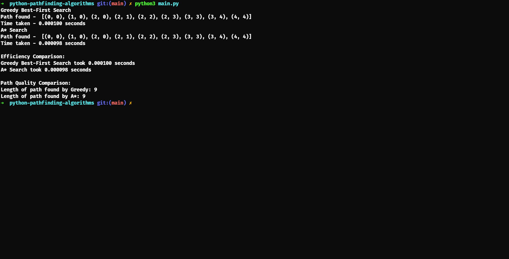
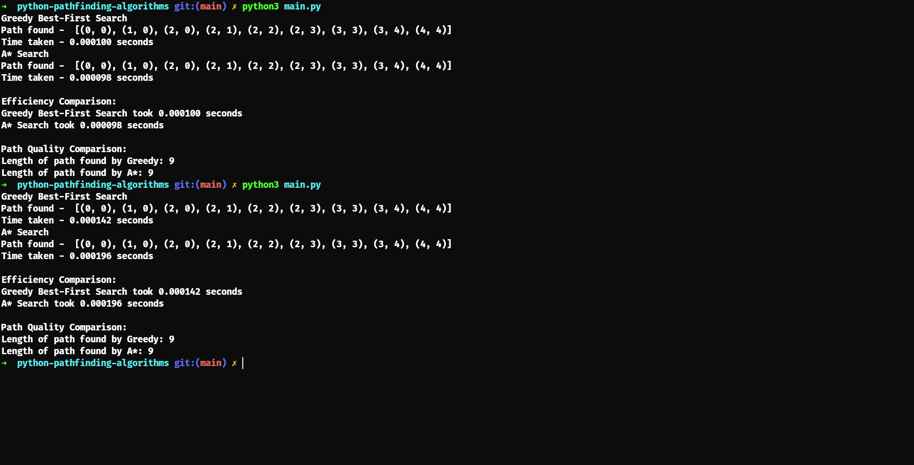
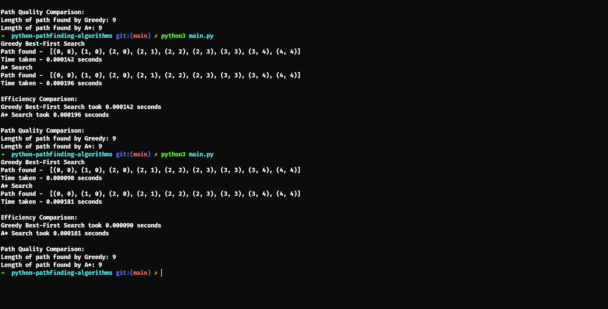
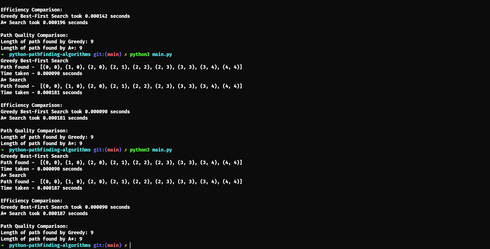

# Python Pathfinding Algorithms

## Overview

**Greedy Best-First Search**

A search algorithm that expands nodes based solely on their heuristic value, which estimates the distance from the current node to the goal

We use the Manhattan distance as our heuristic, calculating the distance from a node to the treasure (goal) by summing the absolute differences between their x and y coordinates.

**A Star Search**

A pathfinding algorithm that considers both the actual cost to reach a node from the start (g(n)) and the estimated cost to reach the goal from that node (h(n))

In this implementation, g(n) is the accumulated cost from the start to the current node, while h(n) is the Manhattan distance to the goal

## Run

python main.py

## Description

For the implementation of the A* search algorithm om the activity, we used a dictionary to keep track of the cost and the visited cells. This structure avoids the complexity of creating dedicated cell classes with attributes like f, g, and h values or using a 2D Boolean matrix to mark visited cells compared to other approaches. And as per the instructions, we utilized Manhattan distance as the heuristic, which simplifies computation since it restricts movement to orthogonal directions compared to other heuristics like Euclidean distance, which can return slightly more precise paths but requires additional calculations. And finally, to retrieve the final path, we used a path reconstruction function, which allows the algorithm to backtrack from the goal to the start.
For our Greedy Best-First Search we used tuples and dictionaries to represent nodes and store paths as the main data structures, which are then stored in a priority queue. Like A*, we utilized Manhattan distance as the heuristic for Greedy Best-First Search. Additionally, the path reconstruction function was used here as well, enabling the algorithm to trace the path taken once the goal is reached.

## Screenshots

